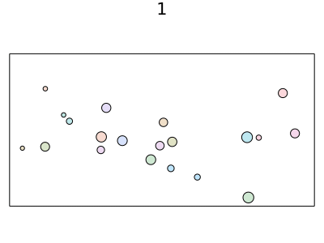

# GeometryObjects.jl
Demonstrate [2D elastic collision](https://en.wikipedia.org/wiki/Elastic_collision) in Julia



# How to use

```console
$ julia --project=@. -e 'using Pkg; Pkg.instantiate()'
$ julia --project=@. demo.jl
```

After that you'll see a gif file `result.gif` is generated.
